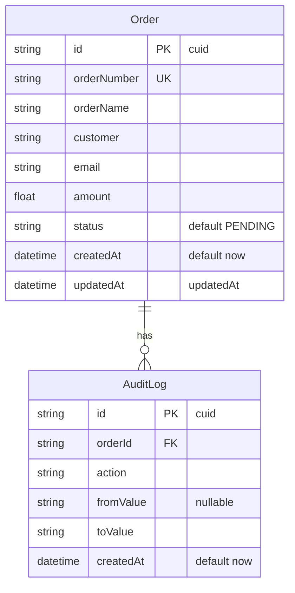

# Mini Order App

## ERD / Schema




## Prompt Used
```md
1. Build a modern SaaS order management dashboard using Next.js App Router, TypeScript, TailwindCSS, shadcn/ui, TanStack Table, and Prisma + SQLite with clean minimalist design, responsive sidebar layout, stats cards, order table with pagination/search/filter, status transition business rules (Pending → Paid/Cancelled, immutable terminal states), audit logging, 30-seed dummy data, loading skeletons, and feature-based folder structure.
2. Fix the Pay and Cancel action buttons on pending orders — server action signature was using the `useActionState` two-parameter pattern but was called directly; simplified to a single-argument `FormData` signature so the form actions correctly update the database.
3. Remove unused navigation items from the sidebar, keeping only the Dashboard link.
4. Replace the sidebar logo text with theme-aware PNG images (dark/light variants) that switch based on the active theme.
5. Replace the `next-themes` theme toggle with a Zustand-powered theme store for state management.
6. Add an `orderName` column to the Order schema, update the seed data with ads/ROAS-related campaign names and Rupiah amounts, and reflect the new field in the order table and search queries.
7. Replace separate Status Tabs and Search Bar with a unified Order Toolbar combining status tabs (with badge counts) and search input in a single row.
8. Update the Revenue stats card icon from DollarSign to Banknote and format amounts as Rupiah (Rp) with Indonesian locale.
9. Fix light mode border visibility by darkening the `--border` and `--sidebar-border` CSS variables so borders remain visible on white backgrounds.
10. Replace the global font from Geist to Plus Jakarta Sans (weights 200–800) via `next/font/google` and apply explicit font-family declarations across all dashboard, header, sidebar, and detail panel components.
11. Add a Mermaid ERD diagram to the README schema section visualizing the Order and AuditLog relationship.
12. Add a "Welcome back to Soci-o-rder!" subtitle below the header title.
13. Update toolbar badge pill colors to follow the Sociotrax color palette — dark grey (#54595F) background with white text in light mode, inverted in dark mode.
14. Widen the toolbar search input to fill the remaining horizontal space beside the status tabs.
15. Fix order detail panel amount format from USD ($) to Rupiah (Rp) and apply Plus Jakarta Sans font.
16. Standardize status badge pill widths to match the longest status label ("Cancelled") for consistent column alignment.
17. Adjust `--border`, `--input`, and `--sidebar-border` CSS variables for better contrast in both light and dark modes — darker borders on white, more visible borders on dark backgrounds.
18. Make the "Cancelled" status pill solid red with white text in both light and dark modes.
19. Add a yellow "warning" badge variant and apply it to the "Pending" status pill with dark text for readability.
20. Make the Cancel Order button solid red with white text in both light and dark modes.
21. Restyle the sidebar with a flush active state — active nav item has a red accent background, bold red text, right-edge flush against the sidebar border, and a red vertical accent line.
```

## Token Used

Total tokens used: **17,018,817**